  Here is the **final professional `README.md`** for your **GitHub project**, focusing on **ThingSpeak integration and website visualization**.  

---

# **🌐 Web-Based EMG Signal Visualization**  

## **📌 Project Overview**  
This project focuses on processing **EMG signals** and visualizing them on a **custom website** using data from **ThingSpeak IoT**. Since **ThingSpeak private channels require a subscription for public access**, we implemented a **backend API** to fetch and display the data seamlessly.  
The goal is to process, analyze, and visualize EMG signals in both time and frequency domains while making the website **more advanced with oscilloscope-like features**.
## **📜 Workflow Diagram**  

```mermaid
graph TD;
  A[🔹 ESP32 Microcontroller] -->|Wi-Fi Transmission| B[🔹 ThingSpeak IoT Platform]
  B -->|API Fetching & Data Processing| C[🔹 Custom Website]
  C -->|Real-Time Signal Display| D[🔹 User Visualization]
```

---

## **🌍 Software Setup: Connecting ThingSpeak to Website**  

### **1️⃣ Step 1: Set Up ThingSpeak Channel**  
1. **Sign up** on [ThingSpeak](https://thingspeak.com/) and create a new **channel**.  
2. Add **Field 1** for **Time-Domain Data** and **Field 2** for **Frequency-Domain Data**.  
3. Go to **API Keys** and copy your **Read API Key**.  

### **2️⃣ Step 2: ESP32 Data Upload to ThingSpeak**  
- ESP32 sends **EMG data** to ThingSpeak via HTTP POST requests.  
- The data includes **filtered EMG signals** in **time and frequency domains**.  

---

### **3️⃣ Step 3: View Data on Custom Website**  
Once the **ESP32 successfully uploads EMG signals** to ThingSpeak, the **custom website fetches the data in real-time** and displays:  

✅ **Time-Domain Graph**  
✅ **FFT-Based Frequency-Domain Graph**  
✅ **User-Friendly EMG Signal Visualization**  

**🔗 Access the Website Here:**  
👉 [**EMG Signal Visualization Website**](#) _(Replace with actual link)_  

---

## **📢 How It Works**
1️⃣ ESP32 **sends EMG data** to ThingSpeak.  
2️⃣ ThingSpeak **stores the data** in private channels.  
3️⃣ The website **fetches data using the API**.  
4️⃣ The data is **displayed in real-time** for analysis.  

---

## **👨‍💻 Contributors (STEM Team)**  
- **🔹 [Thamilezai Ananthakumar](https://github.com/ThamilezaiAnanthakumar)**  
- **🔹 [Sukithan Thillainatha](https://github.com/Sukithan)**  
 

---

## **🚀 Future Enhancements**   
🔹 Optimize **backend API for low-latency data fetching**.  
🔹 Oscilloscope-Like Features: Improve the website by integrating zoom, pan, and cursor tracking to analyze signals better.
🔹 Real-Time Annotations: Implement an AI-based feature to detect abnormalities and highlight signal variations.

---

  
 
